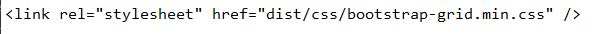
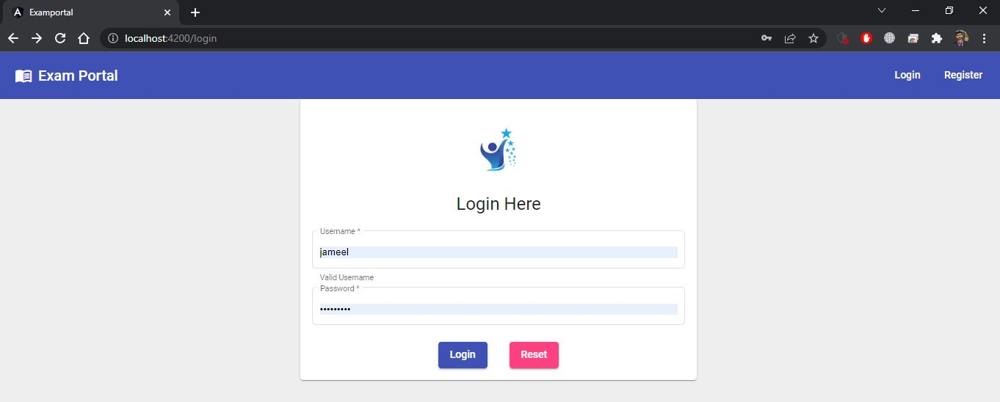
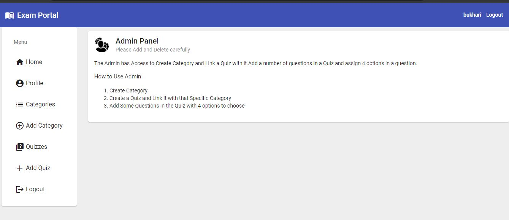
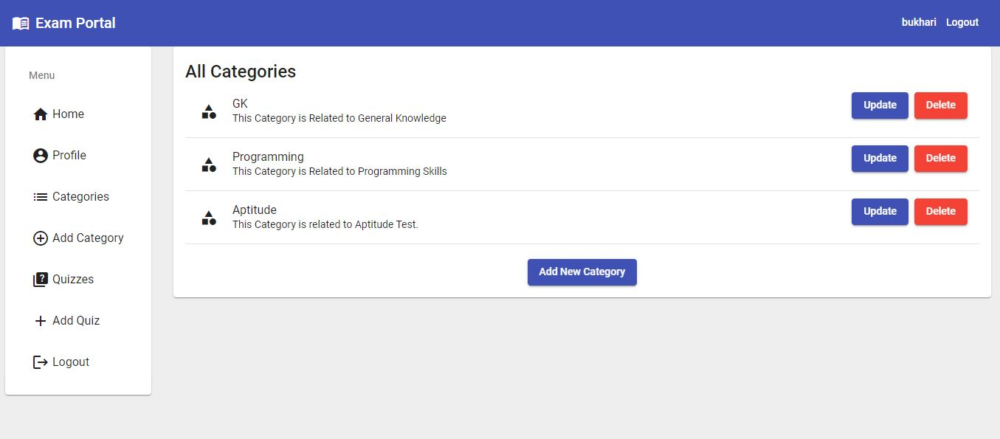
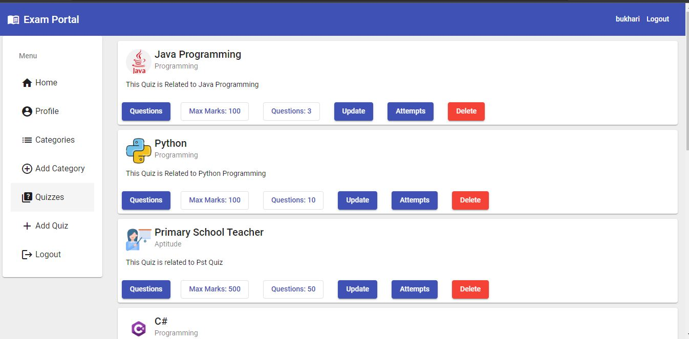
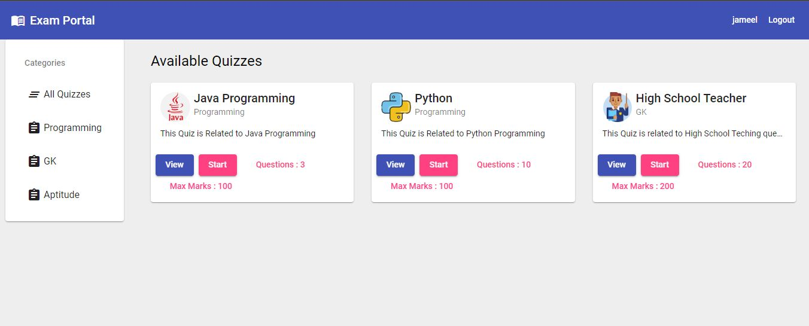
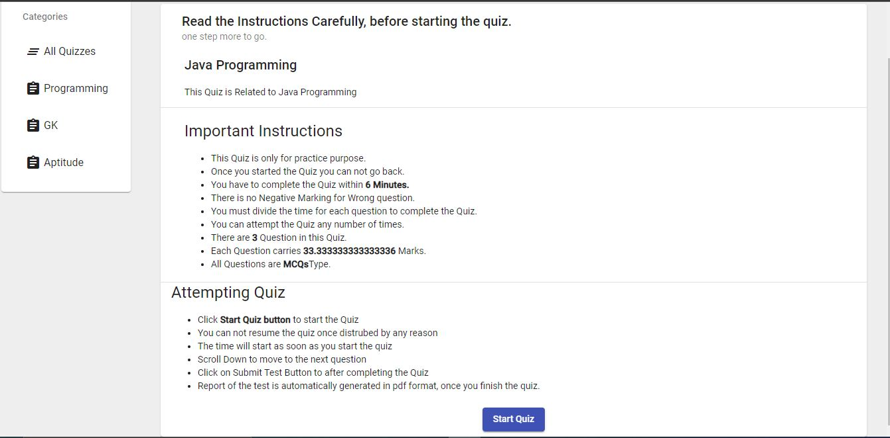
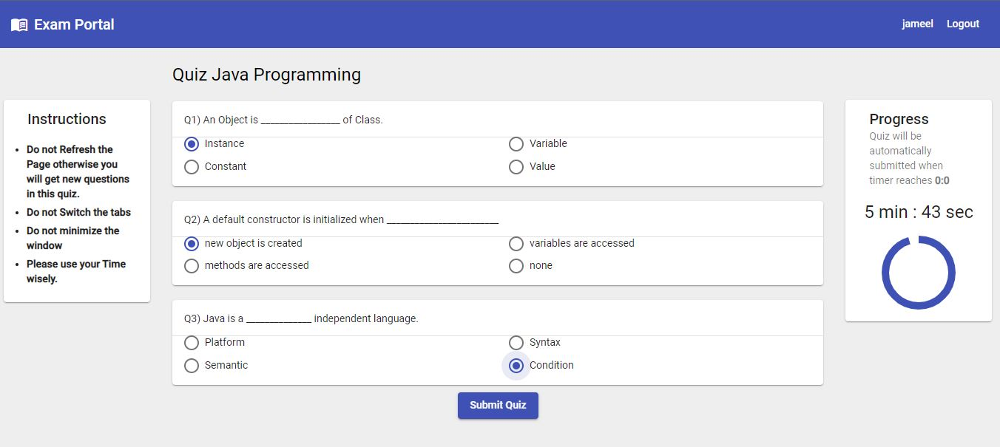
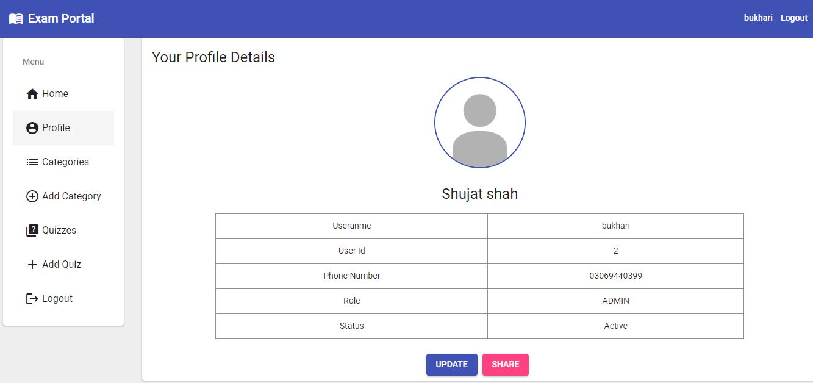
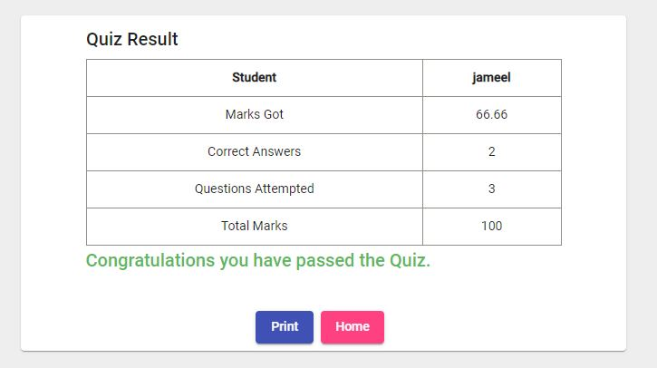

# Full_Stack_Exam_Portal

### For Angular You Need to Follow These Steps.

1. Install Node Js From [ https://nodejs.org/en/ ]
   Note: To check the Node is Intalled. open Cmd and type node -v.
   When we install Node js The Npm gets intalled with it.
   Note: To check the Npm(Node Package Module) is intalled Type npm -v.
   
2. Install Angular Cli By npm install -g @angular/cli
   Note: To chech It is installed type ng --version

Everything is set to go.
To Check the Angular is intalled type ng version

After you open the angular project type npm install to reinstall the packages according
to your project import in your IDE.

If you are Creating New Project

1. To Install Angular Material Type "ng add @angular/material"
2. To Install the Bootstrap Grid Type "npm install bootstrap-grid-only-css --save". then Type 
in the head section of the index.html File.
3. To Install SweetAlert for popup Message Type "npm install --save sweetalert2". then to use it "import Swal from 'sweetalert2';" in every ts File. 

## Exam Portal Look and Feel

### Admin Perspective
#### Login Page

#### Admin Dashboard

#### Category

#### Quiz

### User Perspective
#### Available Quiz Page

#### Instructions Page

#### Quiz Started Page

#### User Details Page

#### Result Page

